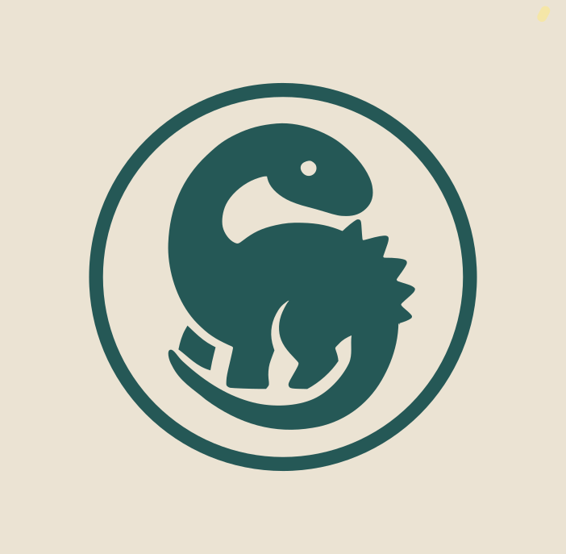

<div align="center">
  

  *the sync engine behind [rim](https://instagram.com/reclaim.intimate.mutuality)*
</div>

# Soradyne

A protocol and toolkit for secure, peer-to-peer self-data flows. Soradyne gives you real ownership of your data — split across physical devices you hold, synced over Bluetooth, encrypted end-to-end, with no cloud in between.

Soradyne is the technical core of **[rim](https://www.rim.gs/)** — a project reclaiming data sovereignty in the age of wearables. rim builds person-to-person systems for storing and sharing intimate live data streams, using SD-core wearables and edge-based storage instead of the cloud. Soradyne is the protocol that makes those devices work together.

## How It Works

### Data Dissolution and Crystallization

Your data doesn't live on one device. Soradyne **dissolves** it — splitting files across multiple physical storage devices using Shamir secret sharing and Reed-Solomon erasure coding. Each device holds a shard. No single shard reveals anything. Any sufficient subset of your devices can **crystallize** the data back.

```
Your file
  ↓
AES-256-GCM encryption (unique key per block)
  ↓
Reed-Solomon erasure coding → n shards (e.g. 5)
  ↓
Shamir secret sharing of the encryption key → n key shares
  ↓
(shard + key share) distributed to each rimsd device
  ↓
Any k-of-n devices (e.g. 3-of-5) → full reconstruction
```

This is implemented and working today. Initialize your devices, dissolve data across them, and crystallize it back from any threshold subset — even if some devices are lost or damaged.

### Self-Data Flows and CRDT Sync

Soradyne's flow engine lets multiple devices collaborate on shared data structures that converge automatically. The **convergent document** system is a full CRDT implementation with five primitive operations (add, remove, set field, add to set, remove from set) and causal tracking that guarantees all devices reach the same state — no matter what order edits arrive.

When two people edit the same data on different devices:

```
Device A writes op₁    Device B writes op₂ (concurrently)
        ↓                       ↓
   local journal           local journal
        ↓                       ↓
        ←── sync over BLE ──→
        ↓                       ↓
   materialize()           materialize()
        ↓                       ↓
   same result             same result
```

Conflict resolution is deterministic: informed-remove semantics for deletions (a delete only affects state the deleter had seen), latest-wins for scalar fields, and add-wins for sets. Three-device sync has been tested end-to-end with topology routing across a mesh.

### Bluetooth Transport

Soradyne owns the radio. The BLE layer handles device discovery, pairing, and encrypted communication:

- **Pairing**: X25519 key exchange over BLE, confirmed with a 6-digit PIN derived from the shared secret, followed by encrypted transfer of capsule credentials (AES-256-GCM)
- **Sessions**: Noise IKpsk2 protocol (the same framework used by Signal and WireGuard) with pre-shared keys bound to capsule membership
- **Topology**: Devices form mesh networks and route messages with TTL-based forwarding — no hub required

Real BLE pairing works today between Android (peripheral) and macOS (central). Mesh sync over BLE is the active development frontier.

## Security

Soradyne uses industry-standard cryptography throughout:

| Layer | Primitive | Implementation |
|-------|-----------|----------------|
| Key exchange | X25519 ECDH | `x25519-dalek` |
| Encryption | AES-256-GCM | `aes-gcm` (AEAD) |
| Signing | Ed25519 | `ed25519-dalek` |
| Key derivation | HKDF-SHA256 | `hkdf` |
| Session encryption | Noise IKpsk2_25519_AESGCM_SHA256 | `snow` |
| Secret sharing | Shamir over GF(256) | custom implementation |
| Erasure coding | Reed-Solomon | `reed-solomon-erasure` |
| Memory safety | Zeroize on drop | `zeroize` |

Every encryption operation uses a fresh random nonce. Per-block master keys are never reused. Capsule key bundles support epoch-based rotation. The entire protocol runs without any server or cloud dependency.

## Architecture

```
┌─────────────────────────────────────────────────┐
│  Flutter / CLI                                   │
│  (UI and interaction layer)                      │
├─────────────────────────────────────────────────┤
│  FFI bridge (C ABI)                              │
├─────────────────────────────────────────────────┤
│  soradyne_core (Rust)                            │
│                                                  │
│  storage/     dissolution, erasure coding,       │
│               block management, rimsd devices    │
│                                                  │
│  convergent/  CRDT engine, schemas,              │
│               causal horizon tracking            │
│                                                  │
│  flow/        DripHostedFlow, host election,     │
│               journal persistence, sync          │
│                                                  │
│  ble/         transport traits, BLE central      │
│               (btleplug), BLE peripheral (JNI),  │
│               simulated network, Noise sessions  │
│                                                  │
│  topology/    pairing engine, ensemble manager,  │
│               mesh routing                       │
│                                                  │
│  identity/    device keys, capsule key bundles,  │
│               X25519/Ed25519, HKDF               │
└─────────────────────────────────────────────────┘
```

## Quick Start

### Prerequisites

- Rust (latest stable)
- Flutter (for demo apps)
- Android NDK (for Android builds)

### Build and Run

```bash
# Build the core library
cd packages/soradyne_core
cargo build --release

# Run the dissolution storage demo
cargo run --example block_storage_demo

# Run tests
cargo test --no-default-features

# Build with BLE central support (macOS)
cargo build --release --features ble-central --no-default-features

# Bootstrap Flutter packages
melos bootstrap

# Run the demo app
cd apps/soradyne_demo/flutter_app && flutter run -d macos
```

### Initialize rimsd Devices

```bash
# Run the block storage demo CLI
cargo run --example block_storage_demo

# Commands:
#   init          — initialize connected SD cards as rimsd devices
#   w <text>      — dissolve text across devices
#   r <id>        — crystallize a block back from shards
#   t <id>        — test fault tolerance (simulate lost devices)
#   s             — storage stats across all devices
```

## Monorepo Layout

```
packages/
  soradyne_core/       Rust: protocol, crypto, storage, BLE, CRDT
  soradyne_flutter/    Flutter plugin (FFI bridge to soradyne_core)
  giantt_core/         Dart: task dependency graph engine
  ai_chat_flutter/     Flutter: AI chat with action calling
apps/
  soradyne_demo/       Flutter demo (pairing, flow sync, albums)
  giantt/              Flutter task management app
  inventory/           Flutter personal inventory app
```

## Key Concepts

- **Capsule** — a trust group of devices. Established via BLE pairing with cryptographic verification. Holds shared encryption keys.
- **Piece** — one device in a capsule, with a role (Full or Accessory) and unique identity.
- **Self-Data Flow** — a user-owned data stream that syncs peer-to-peer across capsule members.
- **Dissolution** — splitting encrypted data across physical devices using erasure coding and secret sharing. No single device holds enough to reconstruct.
- **Crystallization** — recombining shards from a threshold of devices to recover the original data.
- **rimsd** — an SD card or flash storage device initialized for use with Soradyne's dissolution protocol.

## License

This project is licensed under the MIT License — see the LICENSE file for details.

---

<div align="center">
  <sub>a <b>rim</b> project — <a href="https://instagram.com/reclaim.intimate.mutuality">@reclaim.intimate.mutuality</a></sub>
</div>
